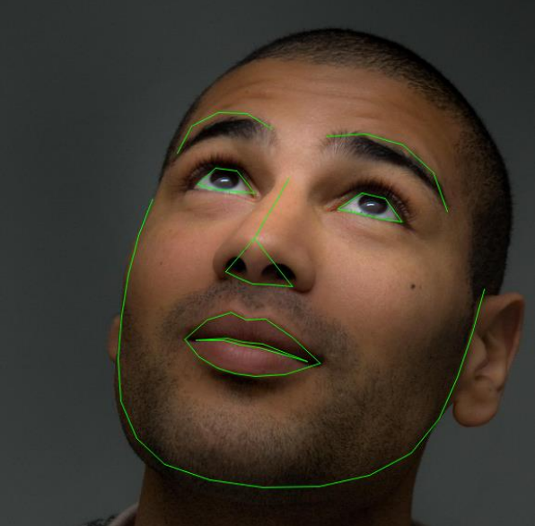
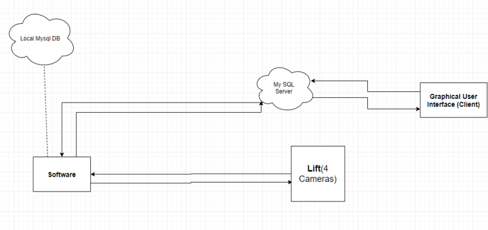

### Description to the approach
 
## Smart Elevator
------

This Project retrieves the face emending of the person’s face from a picture,
rather than converting it to a massive set of pixels and passing them to the CNN model,
the embeddings are created on person’s face which are, set of vectors that later
get converted into the set of 128 hidden encodings, these encodings can be saved
in the Data-base along with the rest of the encodings of different people that can
be used later as a list of encodings to recognize the entered persons identity.

The best part about this Algorithm was that, it can
take only one picture to Train and the process of Training takes only 1 to 2
minutes, following that, the identity of the person becomes recognizable. This felt
satisfying as it almost fulfilled our expectations, we carried on working on this
method and went deeply on how we can improve and asked the IOT Business
Development Policy team to check whether we can customize the libraries for
Volo’s use because the libraries were posted by different people online as Open
source, but some of them did not have license. After the IOT Business
Development Policy team has contacted with the owners and agreed on terms of
use, we continued working on the libraries.

When the project was complete, it was dpeloyed on Myswl Servers to connect with a ll the cameras in the lift automatically while performing the face recogonition, if a new face would appear the managemnt team would chose to add the persons identity into the system after which it would train and update the database and add new trained user's face encodings.

The work processes were carried as it is shown in the following pipline.

